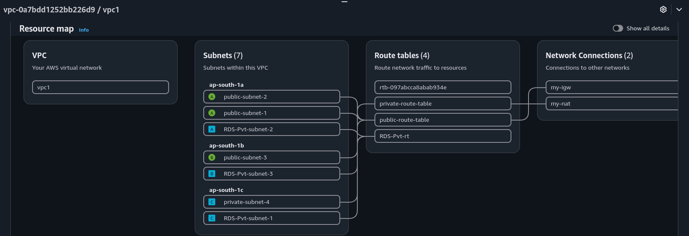
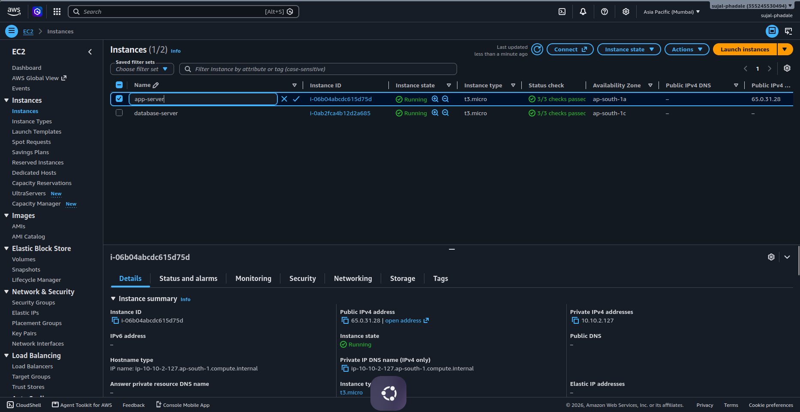
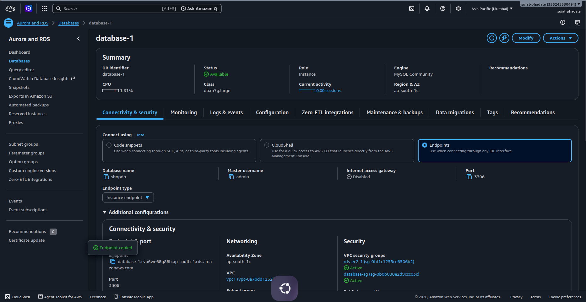
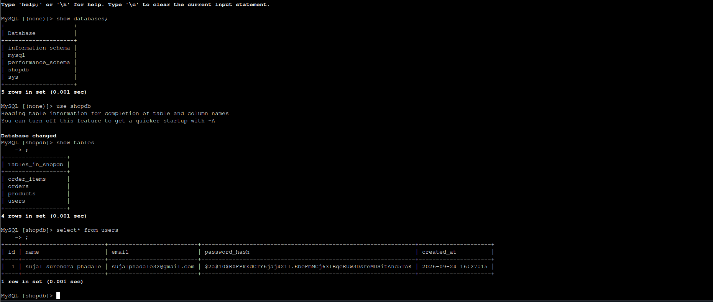
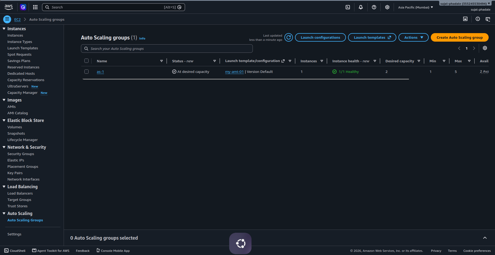
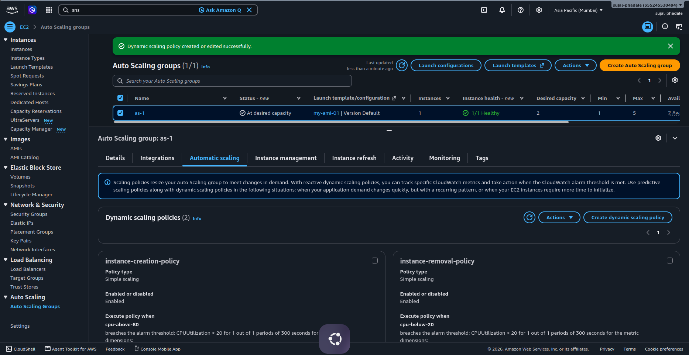
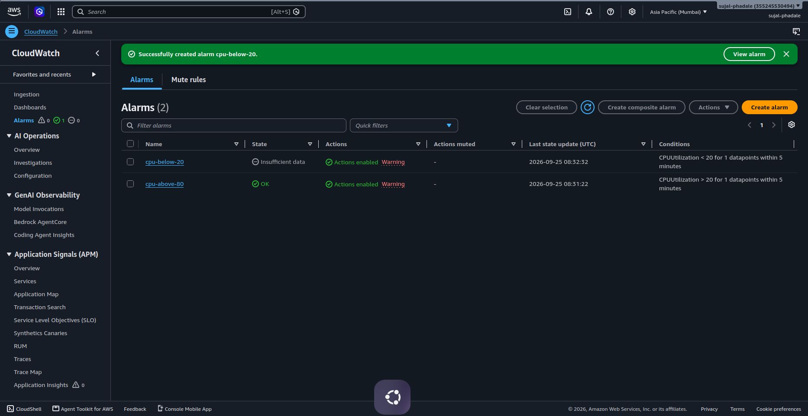
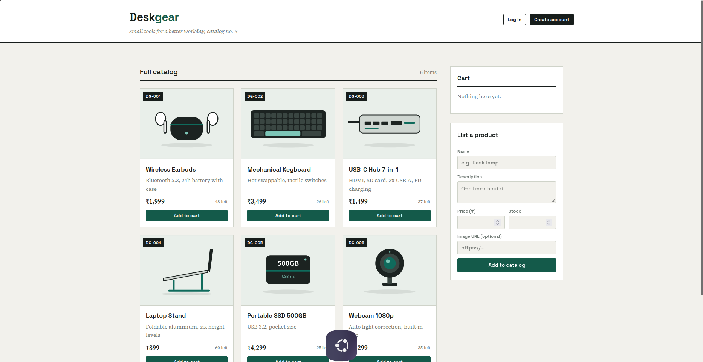

# Deskgear — E-Commerce Application on AWS


A small full-stack e-commerce application deployed on **Amazon Web Services (AWS)** using **Node.js, Express, MySQL on Amazon RDS, Amazon EC2, Amazon VPC, Application Load Balancer, Auto Scaling, and Amazon CloudWatch**.

The project demonstrates how a web application can be separated into network, application, and database tiers while using AWS networking and security controls.

> **Project:** Deskgear — E-Commerce Application on AWS  
> **Prepared by:** Sujal Surendra Phadale  
> **Role:** AWS Cloud Intern, F13 Technologies  
> **Date:** September 2026

---

## Table of Contents

1. [Project Overview](#1-project-overview)
2. [Objectives](#2-objectives)
3. [Technology Stack](#3-technology-stack)
4. [Architecture](#4-architecture)
5. [AWS Resource Inventory](#5-aws-resource-inventory)
6. [VPC and Network Configuration](#6-vpc-and-network-configuration)
7. [Security Groups](#7-security-groups)
8. [EC2 and Application Servers](#8-ec2-and-application-servers)
9. [Amazon RDS MySQL](#9-amazon-rds-mysql)
10. [Database Verification](#10-database-verification)
11. [Node.js Application](#11-nodejs-application)
12. [Application Configuration](#12-application-configuration)
13. [PM2 Process Management](#13-pm2-process-management)
14. [Application Load Balancer](#14-application-load-balancer)
15. [Auto Scaling](#15-auto-scaling)
16. [CloudWatch Monitoring](#16-cloudwatch-monitoring)
17. [Testing and Verification](#17-testing-and-verification)
18. [Updating the Application](#18-updating-the-application)
19. [Troubleshooting](#19-troubleshooting)
20. [Security Hardening](#20-security-hardening)
21. [Cost Management and Cleanup](#21-cost-management-and-cleanup)
22. [Project Screenshots](#22-project-screenshots)
23. [Repository Structure](#23-repository-structure)
24. [Skills Demonstrated](#24-skills-demonstrated)
25. [Future Improvements](#25-future-improvements)

---

# 1. Project Overview

**Deskgear** is a small e-commerce web application designed to demonstrate deployment of a Node.js application on AWS.

The application allows users to:

- Browse a product catalog
- Create an account
- Log in
- Add products to a cart
- Place orders
- View previous orders
- List new products in the catalog

The application uses **Express** as the backend runtime and **MySQL on Amazon RDS** as the database.

The AWS deployment demonstrates:

- Amazon VPC networking
- Public and private subnets
- Internet Gateway
- NAT Gateway
- Route tables
- EC2 instances
- Amazon RDS for MySQL
- Application Load Balancer
- Auto Scaling
- CloudWatch alarms
- Security Groups
- SSH-based administration
- PM2 process management

---

# 2. Objectives

The main objectives of this project are:

- Deploy a Node.js application using multiple AWS resources instead of a single server.
- Separate application and database responsibilities.
- Use Amazon RDS instead of maintaining MySQL manually on an application server.
- Distribute application traffic through an Application Load Balancer.
- Configure Auto Scaling for application capacity.
- Monitor EC2 CPU utilization using Amazon CloudWatch.
- Apply Security Group rules to control communication between tiers.
- Verify application-to-database connectivity.
- Demonstrate real AWS deployment, troubleshooting, and operational procedures.

---

# 3. Technology Stack

| Layer | Technology |
|---|---|
| Frontend | HTML, CSS, Vanilla JavaScript |
| Backend | Node.js 22.x |
| Framework | Express 4 |
| Database | Amazon RDS for MySQL 8.4 |
| Database Driver | mysql2 |
| Authentication | bcryptjs + JSON Web Token |
| Process Manager | PM2 |
| Compute | Amazon EC2 |
| Networking | Amazon VPC |
| Load Balancing | Application Load Balancer |
| Scaling | EC2 Auto Scaling |
| Monitoring | Amazon CloudWatch |
| Operating System | Amazon Linux 2023 |
| AWS Region | ap-south-1 (Mumbai) |

---

# 4. Architecture

## 4.1 Logical Three-Tier Architecture

```text
                         INTERNET
                            |
                            v
                 +----------------------+
                 | Application Load     |
                 | Balancer             |
                 | HTTP : 80            |
                 +----------+-----------+
                            |
                 +----------+----------+
                 |                     |
                 v                     v
        +----------------+     +----------------+
        | APP Server 1   |     | APP Server 2   |
        | Node.js : 3000 |     | Node.js : 3000 |
        +--------+-------+     +--------+-------+
                 |                      |
                 +----------+-----------+
                            |
                            v
                 +----------------------+
                 | Amazon RDS            |
                 | MySQL : 3306         |
                 | Database: shopdb     |
                 +----------------------+
```

### Administrative path

```text
Administrator
     |
     | SSH
     v
Jump/Bastion Server
     |
     +----> Application Server 1
     |
     +----> Application Server 2
     |
     +----> RDS / MySQL administration
```

### Important implementation note

The original deployment documentation describes a bastion/jump-server model and application servers separated from direct internet access. The **current AWS screenshots also show an Auto Scaling Group and CloudWatch alarms**, while the EC2 screenshot shows the currently running instances as `app-server` and `database-server`. Therefore, this README documents both the demonstrated architecture and the current console evidence rather than assuming resources that are not visible in the screenshots.

---

# 5. AWS Resource Inventory

## 5.1 VPC

| Resource | Value |
|---|---|
| VPC Name | `vpc1` |
| VPC ID | `vpc-0a7bdd1252bb226d9` |
| CIDR | `10.10.0.0/16` |
| Region | `ap-south-1` |

## 5.2 Current VPC Screenshot

The AWS VPC resource map currently shows **7 subnets, 4 route tables, an Internet Gateway, and a NAT Gateway**.



### Subnets visible in the current resource map

| Availability Zone | Subnet |
|---|---|
| ap-south-1a | `public-subnet-2` |
| ap-south-1a | `public-subnet-1` |
| ap-south-1a | `RDS-Pvt-subnet-2` |
| ap-south-1b | `public-subnet-3` |
| ap-south-1b | `RDS-Pvt-subnet-3` |
| ap-south-1c | `private-subnet-4` |
| ap-south-1c | `RDS-Pvt-subnet-1` |

### Route tables visible

- `private-route-table`
- `public-route-table`
- `RDS-Pvt-rt`
- One additional route table shown by its AWS ID

### Network connections visible

- Internet Gateway: `my-igw`
- NAT Gateway: `my-nat`

---

# 6. VPC and Network Configuration

## 6.1 Create the VPC

AWS Console:

**VPC → Your VPCs → Create VPC**

Configuration:

```text
Name: vpc1
IPv4 CIDR: 10.10.0.0/16
Tenancy: Default
```

Enable:

```text
Enable DNS hostnames
```

---

## 6.2 Subnets

The deployment documentation used the following logical subnet layout:

| Subnet | CIDR | AZ | Purpose |
|---|---|---|---|
| public-subnet1 | `10.10.1.0/24` | ap-south-1a | Jump/Bastion |
| public-subnet2 | `10.10.2.0/24` | ap-south-1a | Application / ALB |
| public-subnet3 | `10.10.3.0/24` | ap-south-1b | Application / ALB |
| private-subnet4 | `10.10.4.0/24` | ap-south-1c | RDS |
| private-subnet5 | `10.10.5.0/24` | ap-south-1b | RDS |

The current VPC resource map contains additional RDS/private subnet resources beyond this original five-subnet documentation.

---

## 6.3 Internet Gateway

```text
Name: my-igw
Attached to: vpc1
```

The Internet Gateway provides internet connectivity for resources/subnets whose route table contains:

```text
0.0.0.0/0 → Internet Gateway
```

---

## 6.4 NAT Gateway

The current VPC screenshot shows:

```text
NAT Gateway: my-nat
```

A NAT Gateway can provide outbound internet access to resources placed in private subnets without allowing unsolicited inbound internet connections.

---

## 6.5 Public Route Table

Example configuration:

```text
Route table: public-route-table

Destination       Target
0.0.0.0/0         my-igw
```

Associated with the public application/load-balancer subnets.

---

## 6.6 Private Route Table

Example:

```text
Route table: private-route-table
```

Used for private resources that should not be directly exposed to the internet.

---

# 7. Security Groups

Security Groups are used as the primary network-level access control mechanism.

## 7.1 ALB Security Group

```text
Security Group: alb-sg
```

Inbound:

| Protocol | Port | Source |
|---|---:|---|
| HTTP | 80 | `0.0.0.0/0` |

The ALB is the public entry point.

---

## 7.2 Jump Server Security Group

```text
Security Group: jump-sg
```

Inbound:

| Protocol | Port | Source |
|---|---:|---|
| SSH | 22 | Administrator's IP |

SSH should not be opened to the entire internet.

---

## 7.3 Application Security Group

```text
Security Group: app-sg
```

Inbound:

| Protocol | Port | Source |
|---|---:|---|
| SSH | 22 | `jump-sg` |
| Custom TCP | 3000 | `alb-sg` |

This allows the application to receive application traffic from the ALB and administrative SSH from the jump server.

---

## 7.4 RDS Security Group

```text
Security Group: rds-sg
```

Inbound:

| Protocol | Port | Source |
|---|---:|---|
| MySQL/Aurora | 3306 | `app-sg` |
| MySQL/Aurora | 3306 | `jump-sg` |

This prevents arbitrary public clients from connecting directly to MySQL.

---

# 8. EC2 and Application Servers

The deployment uses Amazon Linux 2023 EC2 instances.

The documented application server configuration is:

```text
Instance type: t3.micro
OS: Amazon Linux 2023
Application port: 3000
```

## Current EC2 console evidence

The current EC2 screenshot shows:

```text
app-server
State: Running
Type: t3.micro
AZ: ap-south-1a
Private IP: 10.10.2.127
Public IPv4: 65.0.31.28

database-server
State: Running
Type: t3.micro
AZ: ap-south-1c
```



> The screenshot shows a `database-server` EC2 instance as well as the RDS deployment. The managed database used by the application is documented separately in the RDS section.

---

# 9. Amazon RDS MySQL

The application database is hosted using **Amazon RDS for MySQL**.

The documented database configuration includes:

```text
Database name: shopdb
Master username: admin
Port: 3306
Engine: MySQL 8.4
Public access: No
VPC: vpc1
```

The current RDS console screenshot shows:

```text
DB identifier: database-1
Status: Available
Engine: MySQL Community
Class: db.m7g.large
Availability Zone: ap-south-1c
Database name: shopdb
Master username: admin
Internet access: Disabled
Port: 3306
```



### RDS endpoint

The endpoint is private and should be supplied to the application through an environment variable:

```env
DB_HOST=<RDS_ENDPOINT>
```

Do **not** commit the real endpoint credentials, master password, or secrets to GitHub.

---

# 10. Database Verification

The application database is named:

```text
shopdb
```

The verified tables are:

```text
order_items
orders
products
users
```



### Verify databases

```sql
SHOW DATABASES;
```

### Select the application database

```sql
USE shopdb;
```

### List tables

```sql
SHOW TABLES;
```

### Check registered users

```sql
SELECT * FROM users;
```

The deployment screenshot confirms a registered user record exists in the `users` table.

---

# 11. Node.js Application

## 11.1 Project Structure

```text
ecommerce-app/
├── package.json
├── server.js
├── .env.example
└── public/
    ├── index.html
    └── images/
        └── product illustrations
```

---

## 11.2 Database Schema

### `users`

Stores registered accounts.

Important fields:

```text
id
name
email
password_hash
created_at
```

### `products`

Stores catalog products.

```text
id
name
description
price
stock
image_url
```

### `orders`

Stores placed orders.

```text
id
user_id
total
created_at
```

### `order_items`

Stores individual items within an order.

```text
id
order_id
product_id
qty
price
```

The application can initialize the database schema and sample products on first startup.

---

# 12. Application Configuration

## 12.1 Install Node.js

On Amazon Linux:

```bash
sudo dnf install -y nodejs npm
```

Verify:

```bash
node -v
npm -v
```

---

## 12.2 Install MySQL Client

For database connectivity testing:

```bash
sudo dnf install -y mariadb105
```

---

## 12.3 Test RDS Connectivity

```bash
mysql -h <RDS_ENDPOINT> -u admin -p shopdb
```

If the connection succeeds, verify:

```sql
SHOW TABLES;
```

---

## 12.4 Upload the Application

From the administrator's machine:

```bash
scp ecommerce-app.zip app1:~/
```

Connect:

```bash
ssh app1
```

Extract:

```bash
unzip -o ecommerce-app.zip
cd ecommerce-app
```

---

## 12.5 Configure Environment Variables

Create the environment file:

```bash
cp .env.example .env
```

Generate a secure JWT secret:

```bash
openssl rand -hex 32
```

Edit:

```bash
nano .env
```

Example:

```env
PORT=3000

DB_HOST=<RDS_ENDPOINT>
DB_PORT=3306
DB_USER=admin
DB_PASSWORD=<RDS_MASTER_PASSWORD>
DB_NAME=shopdb

JWT_SECRET=<GENERATED_SECRET>
```

Secure the file:

```bash
chmod 600 .env
```

### Important

The same `JWT_SECRET` must be used by every application server behind the load balancer. Otherwise, authentication tokens may fail when requests move between servers.

---

# 13. PM2 Process Management

Install PM2:

```bash
sudo npm install -g pm2
```

Start the application:

```bash
pm2 start server.js --name shop
```

Check status:

```bash
pm2 status
```

Save the process list:

```bash
pm2 save
```

Configure startup:

```bash
pm2 startup
```

Run the `sudo env PATH=...` command printed by PM2.

---

## Health Check

```bash
curl localhost:3000/health
```

Expected response:

```json
{"status":"ok"}
```

---

## Useful PM2 Commands

```bash
pm2 status
pm2 logs shop
pm2 restart shop
pm2 delete shop
pm2 save
```

### Important operational rule

Use one operating-system user consistently.

For example:

```text
ec2-user → PM2 → application
```

Do not start PM2 as root and later manage the same application as `ec2-user`, because each user can have a separate PM2 daemon/process list.

---

# 14. Application Load Balancer

The ALB provides the public entry point for the application.

## 14.1 Target Group

Configuration:

```text
Target Group: shop-tg
Target type: Instances
Protocol: HTTP
Port: 3000
VPC: vpc1
Health check: HTTP /health
```

Targets:

```text
APP-server1 : 3000
APP-server2 : 3000
```

---

## 14.2 Application Load Balancer

Configuration:

```text
Name: shop-alb
Scheme: Internet-facing
IP type: IPv4
Listener: HTTP : 80
```

The ALB forwards requests to:

```text
shop-tg → application servers → port 3000
```

The `/health` endpoint is used to determine target health.

---

# 15. Auto Scaling

The current AWS console screenshots show an Auto Scaling Group named:

```text
as-1
```

The screenshot shows:

```text
Desired capacity: 2
Minimum: 1
Maximum: 5
Healthy instances: 1/1 at the time of the screenshot
Launch template: my-ami-01
```



## Dynamic Scaling Policies

The current configuration shows two simple scaling policies:

```text
instance-creation-policy
    Trigger: cpu-above-80

instance-removal-policy
    Trigger: cpu-below-20
```



### Scale-out concept

When the CloudWatch alarm detects CPU utilization above the configured threshold, the Auto Scaling Group can increase application capacity.

### Scale-in concept

When CPU utilization remains below the configured threshold, the scale-in policy can reduce capacity.

> The Auto Scaling Group and scaling policies are visible in the supplied AWS screenshots. The original deployment document listed replacing fixed application servers with an Auto Scaling Group as a future hardening/improvement; the current console evidence shows that this improvement has subsequently been configured.

---

# 16. CloudWatch Monitoring

Amazon CloudWatch is used to monitor EC2 CPU utilization.

The supplied console screenshot shows two alarms:

```text
cpu-below-20
cpu-above-80
```



## `cpu-above-80`

Condition shown:

```text
CPUUtilization > 20
for 1 datapoint within 5 minutes
```

## `cpu-below-20`

Condition shown:

```text
CPUUtilization < 20
for 1 datapoint within 5 minutes
```

The screenshots show:

```text
cpu-above-80 → OK
cpu-below-20 → Insufficient data
```

> Keep the alarm thresholds documented exactly as configured in the AWS console. If you later change a threshold, update the README as well.

---

# 17. Testing and Verification

## 17.1 Application Test

Open the ALB DNS name:

```text
http://<ALB_DNS_NAME>
```

The application should display the Deskgear catalog.



---

## 17.2 User Registration

Test:

```text
Register → Login
```

Verify that a new user is created in:

```text
shopdb.users
```

---

## 17.3 Product Catalog

Verify:

```text
GET /api/products
```

The catalog should display the products stored in MySQL.

---

## 17.4 Cart and Order

Test:

```text
Add product → Cart → Place order
```

Verify the database:

```sql
SELECT * FROM orders;
SELECT * FROM order_items;
```

---

## 17.5 Add Product

Use the **List a product** form.

Verify:

```text
Product submitted
        ↓
POST /api/products
        ↓
MySQL products table
        ↓
Product appears in catalog
```

---

## 17.6 Health Check

On the application server:

```bash
curl localhost:3000/health
```

Expected:

```json
{"status":"ok"}
```

---

## 17.7 Database Test

From a host allowed by `rds-sg`:

```bash
mysql -h <RDS_ENDPOINT> -u admin -p shopdb
```

Then:

```sql
SHOW TABLES;
SELECT * FROM users;
SELECT * FROM products;
SELECT * FROM orders;
SELECT * FROM order_items;
```

---

# 18. Updating the Application

The infrastructure does not need to be rebuilt for normal application-code changes.

## Per-server update

```bash
scp ecommerce-app.zip app1:~/
ssh app1

cd ~/ecommerce-app
unzip -o ~/ecommerce-app.zip

npm install --omit=dev

pm2 restart shop

pm2 logs shop --lines 20
```

Repeat on the second application server when running a fixed two-server configuration.

When using Auto Scaling, prefer updating the launch template/AMI or using a deployment mechanism so newly launched instances receive the same application version.

---

# 19. Troubleshooting

## 19.1 SSH to Jump Server Times Out

Check:

- Administrator public IP
- `jump-sg` inbound rule
- Port `22`
- Internet Gateway
- Public route table
- Public subnet
- Elastic IP association

---

## 19.2 SSH to Application Server Fails

Check:

```text
app-sg
    TCP 22
    Source: jump-sg
```

Also verify the private IP configured for the application server.

---

## 19.3 MySQL Connection Times Out

Check:

```text
rds-sg
    TCP 3306
    Source: app-sg
```

For administrative access, also check:

```text
rds-sg
    TCP 3306
    Source: jump-sg
```

Verify the RDS endpoint and port.

---

## 19.4 MySQL Access Denied

Verify:

```env
DB_USER=admin
DB_PASSWORD=<correct password>
DB_NAME=shopdb
```

Do not confuse the EC2 operating-system password with the RDS master password.

---

## 19.5 Application Does Not Start

Run:

```bash
node server.js
```

This can expose the immediate application error.

Then check:

```bash
pm2 logs shop
```

---

## 19.6 `npm install` Cannot Find `package.json`

Confirm the current directory:

```bash
pwd
ls
```

Then:

```bash
cd ~/ecommerce-app
```

Run:

```bash
npm install
```

---

## 19.7 PM2 Shows `pid N/A` or `0b`

A common cause is using different Linux users for PM2.

For example:

```text
root → PM2 process
ec2-user → different PM2 daemon
```

Use one consistent user.

Check:

```bash
whoami
pm2 status
```

If necessary:

```bash
pm2 delete shop
pm2 start server.js --name shop
pm2 save
```

---

## 19.8 ALB Target Is Unhealthy

Verify:

```bash
curl localhost:3000/health
```

Expected:

```json
{"status":"ok"}
```

Then verify:

```text
app-sg
    TCP 3000
    Source: alb-sg
```

Also confirm:

```text
Target Group → Health checks → /health
```

---

## 19.9 ALB Returns 503

A `503 Service Unavailable` response generally means the ALB currently has no healthy target available.

Check:

1. EC2 instance is running.
2. Node.js application is running.
3. Port `3000` is listening.
4. `/health` returns HTTP 200.
5. `app-sg` allows traffic from `alb-sg`.
6. Target group contains the correct instances and port.

---

# 20. Security Hardening

This project is suitable for learning and demonstration.

For production use, improve the following areas.

## HTTPS

Use AWS Certificate Manager and configure:

```text
HTTPS : 443
```

on the ALB.

Redirect:

```text
HTTP : 80 → HTTPS : 443
```

---

## Secrets

Do not store:

```text
DB_PASSWORD
JWT_SECRET
```

directly in Git.

Use:

- AWS Secrets Manager
- AWS Systems Manager Parameter Store

---

## Database Security

Keep RDS:

```text
Public access: No
```

and allow port `3306` only from trusted security groups.

---

## Authentication Authorization

The demo allows registered users to list products.

For a production marketplace, add role-based authorization such as:

```text
Customer
Admin
Seller
```

and restrict product-management APIs accordingly.

---

## RDS Backup and Availability

For production:

- Enable automated backups.
- Configure appropriate backup retention.
- Consider Multi-AZ deployment.
- Test restore procedures.

---

## Application Scaling

The current console evidence shows an Auto Scaling Group. For a production deployment, ensure that:

- The launch template contains the correct application version.
- New instances automatically configure the application.
- Health checks are configured correctly.
- Scaling policies are based on appropriate metrics.
- Deployments are repeatable.

---

# 21. Cost Management and Cleanup

AWS resources can continue generating charges while they exist.

Pay particular attention to:

- EC2 instances
- RDS
- Application Load Balancer
- NAT Gateway
- Elastic IP when not attached
- EBS volumes
- CloudWatch usage

## Recommended teardown

For a learning environment, remove resources when finished.

Suggested order:

```text
1. Delete Application Load Balancer
2. Delete Target Group
3. Delete/disable Auto Scaling Group
4. Terminate unused EC2 instances
5. Delete RDS instance if no longer required
6. Release unused Elastic IPs
7. Remove NAT Gateway if no longer required
8. Delete route tables
9. Delete subnets
10. Detach/delete Internet Gateway
11. Delete VPC
```

Before deleting RDS, decide whether a final snapshot is required.

---

# 22. Project Screenshots

## VPC Resource Map


## MySQL Database Verification


## Deskgear Application


## Amazon RDS Connectivity


## EC2 Instances


## Auto Scaling Group


## CloudWatch Alarms


## Auto Scaling Policies


---

# 23. Repository Structure

A recommended GitHub repository structure:

```text
deskgear-aws/
│
├── README.md
│
├── ecommerce-app/
│   ├── package.json
│   ├── server.js
│   ├── .env.example
│   └── public/
│       ├── index.html
│       └── images/
│
└── screenshots/
    ├── 01-vpc-resource-map.png
    ├── 02-mysql-database-verification.png
    ├── 03-application-ui.png
    ├── 04-rds-connectivity.png
    ├── 05-ec2-instances.png
    ├── 06-auto-scaling-group.png
    ├── 07-cloudwatch-alarms.png
    └── 08-auto-scaling-policies.png
```

---

# 24. Skills Demonstrated

This project demonstrates practical experience with:

### AWS

- Amazon VPC
- Subnets
- Route Tables
- Internet Gateway
- NAT Gateway
- Security Groups
- EC2
- Elastic IP
- Amazon RDS
- Application Load Balancer
- Target Groups
- Auto Scaling Groups
- Launch Templates / AMIs
- Amazon CloudWatch

### Linux

- Amazon Linux 2023
- SSH
- SCP
- File permissions
- Package installation
- Process management
- Network connectivity testing

### Backend

- Node.js
- Express
- REST APIs
- MySQL
- mysql2
- JWT authentication
- bcrypt password hashing

### Database

- MySQL
- Database and table creation
- SQL queries
- Transactions
- Stock handling
- RDS connectivity

### Operations

- PM2
- Health checks
- Load balancing
- Auto Scaling
- CloudWatch alarms
- Troubleshooting
- Deployment updates

---

# 25. Future Improvements

Potential next steps:

- [ ] HTTPS using AWS Certificate Manager
- [ ] AWS Secrets Manager for application secrets
- [ ] Fully private application subnets
- [ ] Bastion host / Systems Manager Session Manager for administration
- [ ] RDS Multi-AZ
- [ ] Automated RDS backups
- [ ] IAM least-privilege policies
- [ ] AWS WAF on the ALB
- [ ] CloudTrail auditing
- [ ] Centralized application logging
- [ ] CloudWatch dashboards
- [ ] Automated deployment pipeline
- [ ] Blue/green or rolling deployments
- [ ] Infrastructure as Code using CloudFormation/Terraform
- [ ] Containerization with Docker
- [ ] Amazon ECS for container deployment

---

## Conclusion

Deskgear demonstrates a practical AWS deployment of a Node.js e-commerce application with a separated application/database architecture, managed MySQL through Amazon RDS, public traffic through an Application Load Balancer, EC2-based application hosting, Auto Scaling, CloudWatch monitoring, and Security Group-based network controls.

The project also demonstrates real-world operational tasks such as database verification, SSH/SCP deployment, PM2 process management, health checks, load-balancer validation, scaling configuration, and troubleshooting.

---

## Author

**Sujal Surendra Phadale**

AWS Cloud / DevOps Learner

September 2026
